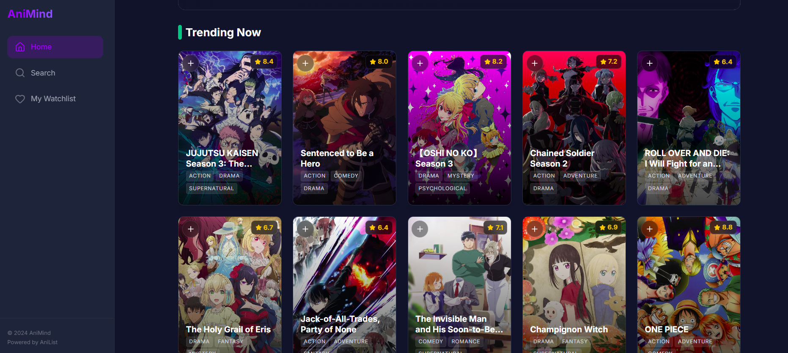

# AniMind - Anime Discovery & Streaming Platform

 


## 🚀 Overview
AniMind is a comprehensive anime discovery and streaming web application. It allows users to search for anime, view details (synopsis, rating, genres), and stream episodes directly. The platform leverages public APIs to fetch real-time data and provide a seamless viewing experience.

## ✨ Features
- **Search & Discovery**: Browse trending, popular, and upcoming anime.
- **Detailed Info**: View synopsis, characters, studios, and score distributions.
- **Streaming**: Watch episodes directly within the app (embedded player).
- **User Lists**: (Optional: If you have this) Track "Watching", "Completed", and "Plan to Watch" lists.
- **Responsive Design**: Optimized for both desktop and mobile viewing.

## 🛠️ Tech Stack
- **Frontend**: [e.g., React.js / Vue.js / HTML5 & CSS3]
- **Backend**: [Node.js]
- **API**: [Gemini API / AniList API]
- **Hosting**: [Vercel]

## ⚙️ Installation & Setup

1. **Clone the repository**
   ```bash
   git clone [https://github.com/FNXDOOM/AniMind.git]
   cd AniMind

## Run Locally

**Prerequisites:**  Node.js


1. Install dependencies:
   `npm install`
2. Set the `GEMINI_API_KEY` in [.env.local](.env.local) to your Gemini API key
3. Run the app:
   `npm run dev`
